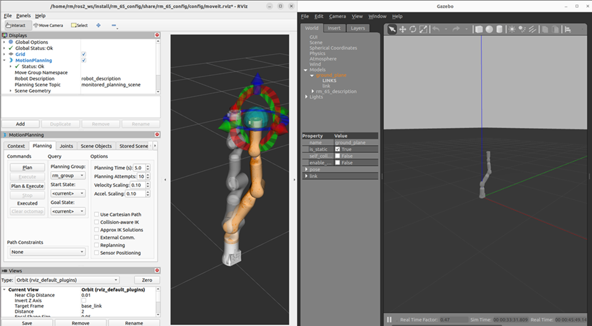

<div align="right">

[简体中文](https://github.com/RealManRobot/ros2_rm_robot/blob/humble1.1.0/rm_gazebo/README_CN.md)|[English](https://github.com/RealManRobot/ros2_rm_robot/blob/humble1.1.0/rm_gazebo/README.md)
 
</div>

<div align="center">

# RealMan Robotic Arm rm_gazebo User Manual V1.0

RealMan Intelligent Technology (Beijing) Co., Ltd. 

Revision History:

|No.	  | Date   |	Comment |
| :---: | :----: | :---:   |
|V1.0	  | 2/19/2024 | Draft |
|V1.1	  | 7/3 /2024 | Amend |
</div>

## Content
* 1.[rm_gazebo Package Description](#rm_gazebo_Package_Description)
* 2.[rm_gazebo Package Running](#rm_gazebo_Package_Running)
* 2.1[Control of the simulation robotic arm](#Control_of_the_simulation_robotic_arm)
* 3.[rm_gazebo Package Architecture Description](#rm_gazebo_Package_Architecture_Description)
* 3.1[Overview of Package Files](#Overview_of_Package_Files)

## rm_gazebo_Package_Description
rm_gazebo is mainly used for realizing the simulation function of robot arm Moveit2 planning. We build a virtual robotic arm in the simulation environment of Gazebo, and then control the virtual robot arm in Gazebo through Moveit2. This package is introduced in detail in the following aspects.
* 1.Package use.
* 2.Package architecture description.
Through the introduction of this part, it can help you:
* 1.Understand the package use.
* 2.Familiar with the file structure and function of the package.
Source code address: https://github.com/RealManRobot/ros2_rm_robot.git。
## rm_gazebo_Package_Running
### Control_of_the_simulation_robotic_arm
After the installation of the environment and the package, we can run the rm_gazebo package.  
Use the following command to launch the Gazebo virtual space and the virtual robotic arm.
```
rm@rm-desktop:~$ ros2 launch rm_gazebo gazebo_65_demo.launch.py
```
In practice, the above <arm_type> needs to be replaced by the actual model of the robotic arm. The available models of the robotic arm are 65, 63, eco65, 75, and gen72. The interface displays as follows after successful running.  

Then, we use the following command to launch moveit2 to control the simulation robot arm in Gazebo.
```
rm@rm-desktop:~$ ros2 launch rm_<arm_type>_config gazebo_moveit_demo.launch.py
```
In practice, the above <arm_type> needs to be replaced by the actual model of the robotic arm. The available models of the robotic arm are 65, 63, eco65, 75, and gen72.   
After the control interface of rviz2 pops up, you can perform the simulation control of moveit2 and Gazebo.

## rm_gazebo_Package_Architecture_Description
## Overview_of_Package_Files
The current rm_gazebo package is composed of the following files.
```
├── CMakeLists.txt                # compilation rule file
├── config
│   ├── gazebo_63_description.urdf.xacro     #63gazebo model description file
│   ├── gazebo_65_description.urdf.xacro     #65gazebo model description file
│   ├── gazebo_75_description.urdf.xacro     #75gazebo model description file
│   ├── gazebo_eco65_description.urdf.xacro  #eco65gazebo model description file
│   └── gazebo_gen72_description.urdf.xacro  #gen72gazebo model description file
├── doc
│   ├── rm_gazebo1.png
│   └── rm_gazebo2.png
├── launch
│   ├── gazebo_63_demo.launch.py             # 63gazebo launch file
│   ├── gazebo_65_demo.launch.py             # 65gazebo launch file
│   ├── gazebo_75_demo.launch.py             # 75gazebo launch file
│   ├── gazebo_eco65_demo.launch.py          # eco65gazebo launch file
│   └── gazebo_gen72_demo.launch.py          # gen72gazebo launch file
├── package.xml
├── README_CN.md
└── README.md
```